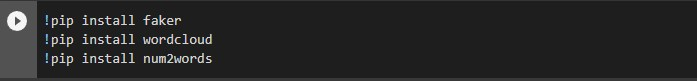
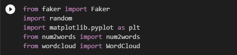
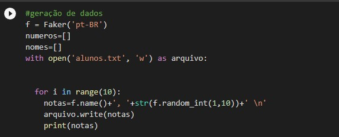
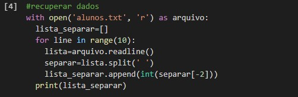
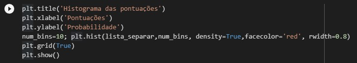
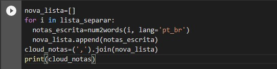
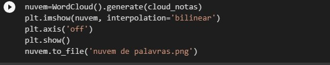
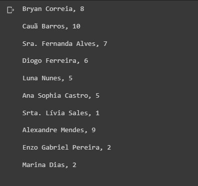
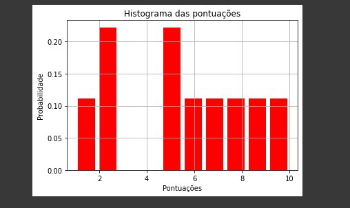
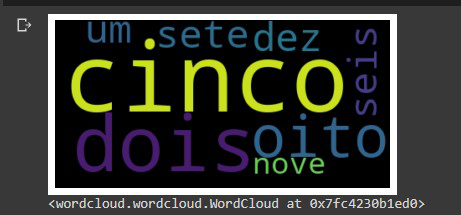

# 📗 Título da Prática:

Implementação de um programa para maniupular dados de um arquivo texto e visualizá-los em um histograma e nuvem de palavras.

## 💡 Objetivo da Prática:

Gerar dados , gravar e recuperar dados de arquivos textos, manipulação dos dados para visualização em um histograma, manipular os dados para visualização em um nuvem de palavras.

## 🖥️ Todos os códigos apresentados e solicitados neste roteiro de aula, devido organizados em células;

## 🏁 Os resultados da execução dos códigos também devem ser apresentados;

### Análise e Conclusão:
Qual a importância de manipular arquivos de texto?
Qual a importância de visualizar os dados em um histograma?
O que significa a visualização por nuvem de palavras?
